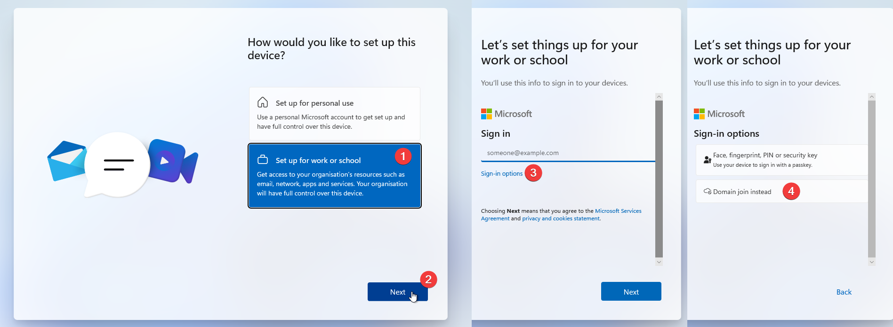
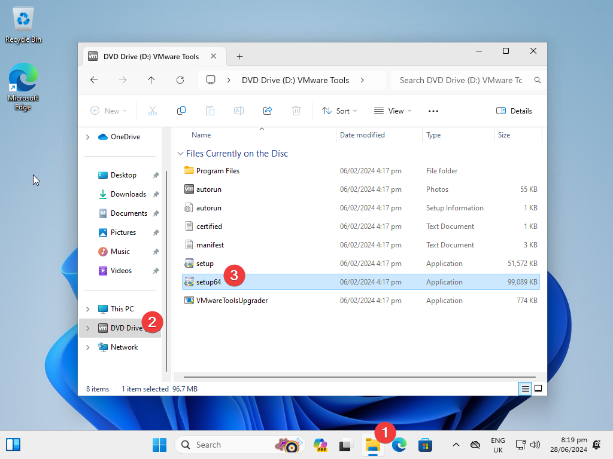

I have had many questions on how to set up a VM for a number of different use-cases. This is the best guide to follow for how to set this up.

:::danger[New Guide]

I reserve the right not to help with specific VM-related issues if you experience issues.

If you find a mistake in this document, please ping me (`cubityfirst`) in the [Elite Farmers Discord](https://discord.gg/farms)
:::
## Why farm in a VM?

Playing inside of a VM has one **major** benefit. You can bind additional HID peripherals from outside of the VM to the VM exclusively. This allows you to input on the game separately to any other application on your computer, allowing you to play multiple games at once, navigate around your computer, or use your computer for more than just farming.
## Requirements

- A modern computer that is capable of virtualization and has it enabled. (You can check if it's enabled in Task Manager -> Performance -> CPU ->Virtualisation : Yes)
	- If your computer is older, it might not support the required technologies to use a VM.
	  You can check [here](https://ark.intel.com/content/www/us/en/ark.html) for Intel chips, and [here](https://www.amd.com/en/products/specifications/processors.html) for AMD chips.
- A spare keyboard and mouse. (if you want to control the VM independently)

---

## Steps

1. Download [VMWare Workstation Pro](https://support.broadcom.com/group/ecx/productdownloads?subfamily=VMware%20Workstation%20Pro) from Broadcom. You will need to make an account.
2. Download a [Windows 11 ISO](https://www.microsoft.com/software-download/windows11) from Microsoft. (Under the header "Download Windows 11 Disk Image (ISO) for x64 devices")
3. Run the installer for VMWare Workstation Pro
4. Skip through & install the application.
5. Open VMWare Workstation Pro
6. Select `Use VMWare Workstation 17 for Personal Use` and press `Continue`.

You should now see a screen that looks like this.

7. Press `Create a New Virtual Machine` and confirm with `Next`.
8. Select the Windows ISO that you downloaded in step 2.

9. Press Next until it asks you for a password.
10. Enter a password that you will remember. This is required for the VM to be created.
11. Choose a disk size. (64GB is fine. Changing this to a single file will slightly help performance.)
12. Press Next  / Complete this creation process.
13. Turn the VM off under `VM` > `Power` > `Shut Down Guest`

14. Start the VM. 

:::warning[Mouse Stuck?]
If your mouse gets stuck inside of the Virtual Machine, you can press `Ctrl + Alt` to release it.
:::

15. Click next, and click the button that says `I don't have a product key`.
16. Select `Windows 11 Pro`
17. Before you press Next, press `Shift + F10`. This will open the Command Prompt.
18. Type `regedit`
19. Navigate to `HKEY_LOCAL_MACHINE\SYSTEM\Setup`
20. Right click the `Setup` folder and create a new `Key`.
21. Rename this Key on the left hand side `LabConfig`.
22. Right click in the blank space in the right, and create a new `DWORD (32-bit) Value` called `BypassTPMCheck`
23. Double click `BypassTPMCheck`, and set it to `1`, and click `OK`
24. Right click in the blank space in the right, and create a new `DWORD (32-bit) Value` called `BypassSecureBootCheck`
25. Double click `BypassSecureBootCheck`, and set it to `1`, and click `OK`

:::info[Double check!]

If these entries are not correct, Windows will complain about not being compatible with this device.

:::
27. Close Regedit, and Command Prompt, and click `Next`.
28. Accept the EULA & Click `Customised: Install Windows only (advanced)`
29. Click `Next`.

Windows will now install, and restart itself! Congratulations!

### Setting up Windows

You should be able to progress through the Windows installation as you would with any normal device. Please select the appropriate keyboard layout as you would, name your device,

If you want to avoid making a Microsoft account, you can follow the below steps.

Once this is done, you can choose the name of your account, password, security questions, and privacy settings.

Windows will now restart... *again*.
### Installing VMWare Tools

VMWare Tools is a suite of additional tweaks and modifications that fix the performance characteristics, and other quirks of a virtual machine.

On the bottom of your VM, you should see a yellow bar prompting you to install VMWare Tools. Press `Install Tools`, and a Drive should appear in your Windows install. Navigate to `D:\` and run `setup64.exe`.  

:::info Did this not appear?
If the VMWare Tools banner doesn't appear at the bottom of your screen, you can install this with `VM` -> `Install (or Upgrade) VMware Tools`.  
:::

Accept the Windows UAC prompt, and press `Next` until you get to the end of the installer and press `Yes` to reboot. 

## What now?

You have a virtual machine for whatever you want to use it for. If you want to install Minecraft, or other mods. I recommend that you read [How to Install Mods](./InstallingMods).

If you want to pass a Keyboard & Mouse through to the VM directly, you can do that by going to `VM` -> `Removeable Devices` -> `TheDeviceYouWant` -> `Connect (Disconnect From Host)`. 

:::info Mouse issues?
If you're having weird mouse issues (inconsistent acceleration / gliding issues) you can modify your .vmx file to change the mouse mode to "Gaming"

You can add `mks.gamingMouse.policy = "gaming"` to your .vmx file in the location you save your VM files (by default this is `C:\Users\%user%\Documents\Virtual Machines`).
:::

---

## Things to keep in mind

1. Make sure to install VMWare Tools, this will allow the window to resize and will increase performance dramatically.
2. If you're assigning multiple cores, make sure to assign multiple cores per socket, instead of multiple sockets.