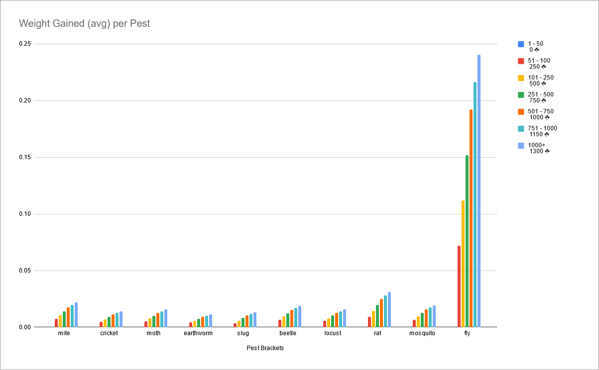

## TL;DR (Too Long, Didn't Read)

Flies are disproportionately powerful compared to the other pests available, and this is negatively impacting the integrity of the leaderboard. 

Please reduce the drop-rate / quantity of wheat from flies to bring it in line with other crops.
## Who we are

I (the person writing this) am CubityFirst, and I'm presently #4 in Wheat, #2 in Seeds, and #8 in Total Farming Weight, and have been farming for ~5000 hours.

The Hypixel Skyblock farming community (which exists predominately in "Elite Skyblock Farmers") uses a system called "Farming Weight" to approximate the differences between these crops and to have one total number that you can use to compare players, despite them potentially having wildly different farming histories. You can read more about the Farming Weight System [here](https://elitebot.dev/info).
This allows for comparison between different disciplines despite the numbers themselves being wildly different, for example -

In an hour you can harvest roughly 4.53m carrots, which would result in ~15 farming weight. An hour of Wheat farming would give ~1.5m Wheat (and some number of seeds), which would result in ~15 farming weight.

## What is the actual issue?

This is a mistake that has been made before. Famously the wheat hoe was prohibitively expensive due to a mix-up in the recipe not considering the fact that the wheat had a different compression ratio compared to most other comparable crops.

Other Crops : 1x160x160 = 25600  
Wheat : 1x9x144x144 = 186624

This is something that is clearly wrong with this. The ratio itself is fine, but the issue is that flies are dropping tightly tied haybales instead of enchanted haybales, and that the quantity that you get in terms of collection is massively disproportionate.

The graph above shows how wildly out of balance this is, and with how unbalanced this is, it feels more like a mistake than an intentional piece of game design.

Euclid Wheat hoes were nerfed in cost when the garden came out when people realized that the recipe was disproportionately high due to the difference in compression ratio.

## How do you break pest farming?

As it stands, Pest Farming has a few quirks that makes it the most effective tactic available. Cactus & Cane have a "bug" where since you're breaking the middle block of a two block tall crop (effectively), you get double the drop-rate on certain items such as Strawberry Dyes, or Pest Spawns.

Additionally, with Spray, Pest Vest, and other buffs you can spawn 5-6 pests every two minutes.

With all of this together, it means that the best way to farm Wheat during a Finnegan mayor, if you have all of the pest buffs, is to farm Cane with Daedalus Axe.

## Why is this a problem?

Most people will agree with the fact that doing an auxiliary activity shouldn't be the best way to progress in the primary skill.

If Golden Goblins magically gave 100,000,000 Gemstones per hour, there would be little reason to actually mine in the first place since it would be better to just stand around and wait for the goblins to spawn, or you would go about optimizing that process instead of the activity that the skill is actually based on.

No-one argues against pests existing at all (despite Macros existing to do them automatically as early as Day 2 of the Alpha), just that the Flies specifically are so completely out of balance that it doesn't make sense to do the main farming activity if you're pushing for leaderboard spots.

As someone who farms 12+ hours a day on average over a 30 day period, it is physically impossible for me to keep up with people that pest farm flies. I'm not against pests making more money, but it shouldn't be the single best way to get the collection for activity.
## How do we fix it?

There are a few ways to fix flies as it stands, the simplest is to just bring it inline with the other pests in terms of drop rate for their individual crops by making them drop higher quantities of Enchanted Haybales instead of Tightly Tied Haybales, or drastically reducing the drop rate for Tightly Tied Haybales.

Some would prefer that it's changed so that flies are still beneficial in terms of money per hour, but not in a way that would impact the leaderboards (for example removing pests from contributing towards crop collections).

Another suggestion that has been put forward is to remove the wheat from their drop table entirely, and replace it with something that would be beneficial elsewhere in the farming skill that don't have an existing leaderboard (Cropies, Squash, Fermento), or new items entirely that benefit a different skill (Hunting XP, or something that would be beneficial towards that system).

## Who is against pest farming impacting leaderboards?

The answer is practically everyone.

The top 5 wheat farmers have all been in agreement that this is damaging towards the integrity of the leaderboard, including the #1 Fly Farmer Sau_Del who has said many times that while he's not doing it strictly speaking for the wheat leaderboard, it still does need nerfing due to how unbalanced they are.

In order (and on the Wheat Leaderboard)

1. Bankhier (#1 Wheat Farmer, #2 Farmer Total)
2. IdkVenom (#2 Wheat Farmer)
3. Sau_Del (#3 Wheat Farmer, #1 in Flies)
4. Cubity_First (#4 Wheat Farmer)
5. B3n5ku (#5 Wheat Farmer)
6. Erksterr (#7 Wheat Farmer)

And other notable guests -

1. Chissl (#2 Melon)
2. Kaeso (Ke5o) (Developer of elitebot.dev)
3. DeadlyIPanda (#3 Melon)

There are more, but due to time constraints on this document, I haven't been able to get an exhaustive list of everyone against.